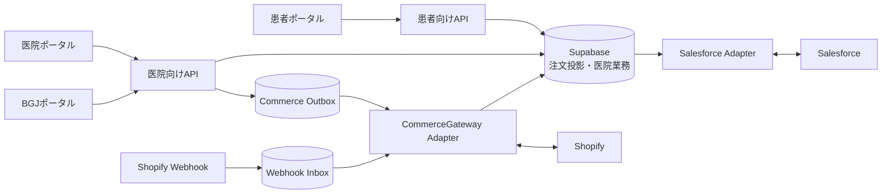
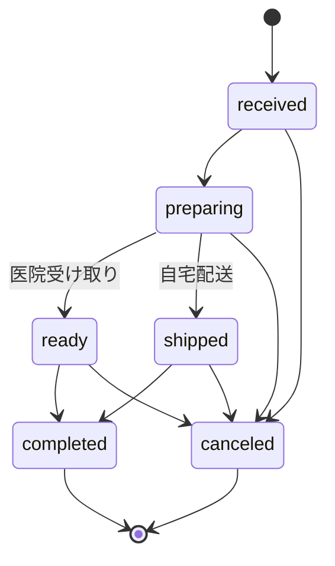
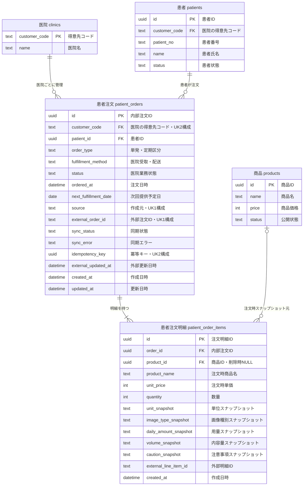
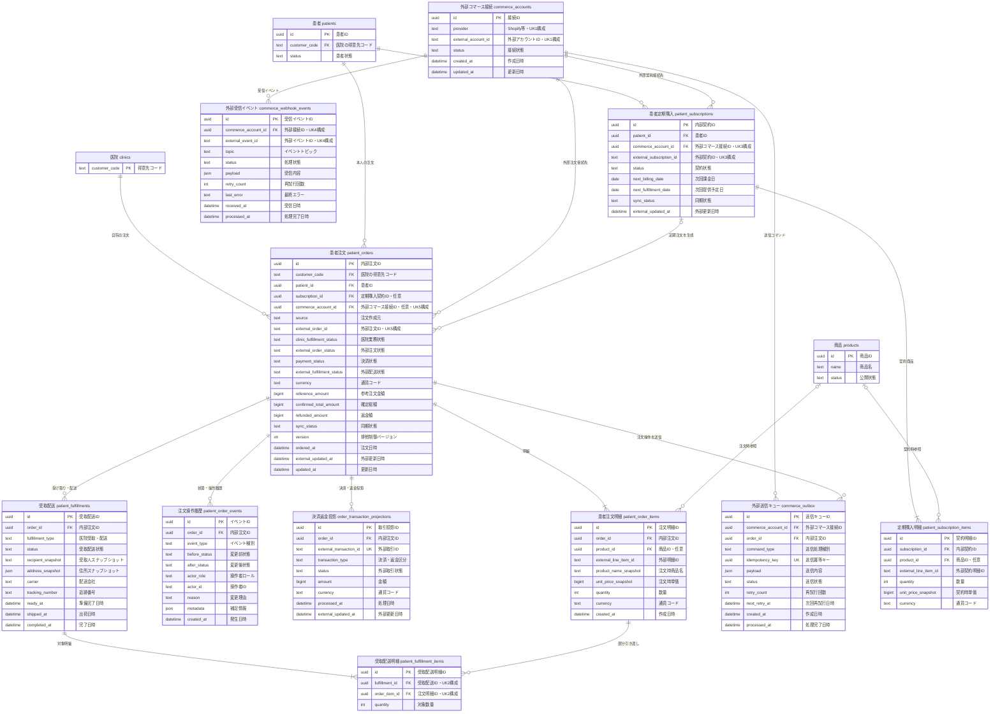

# 医院向け患者注文管理 設計書

文書バージョン: 0.2 Draft

最終更新日: 2026-07-21

対象システム: Web-moc-B2B（患者ポータル・医院ポータル・BGJポータル）

主対象画面: `/admin/orders`、`/medication`

## 1. 目的

本書は、医院が患者向けサプリメント等の注文受付、準備、受け取り、配送進捗を管理するための設計を定義する。

現在はShopify・Salesforce連携前の内部注文基盤が稼働している。今後も現在の内部注文IDを維持しながら外部サービスを接続し、画面や業務フローを作り直さずに拡張できる構成とする。

設計上、次を最優先とする。

- 架空の注文、決済、契約状態を表示しない。
- 保存されていない操作を成功表示しない。
- 医院は自院の患者・注文だけを操作できる。
- 患者は本人の注文だけを閲覧できる。
- Shopify・Salesforceをポータル内で再実装しない。
- 外部連携障害時も、医院の受け取り業務を可能な範囲で継続できる。
- 注文作成、Webhook、再送処理は冪等にする。
- 過去注文は、商品・患者マスタ変更後も監査可能な状態で保持する。

## 2. 用語と対象範囲

### 2.1 本書で扱う注文

本書の「患者注文」は、医院が患者に商品を提供するための注文を指す。データは`patient_orders`・`patient_order_items`で管理し、医院ポータルの「患者注文・受け取り管理」と患者ポータルの「サプリメント受け取り」に反映する。

### 2.2 別ドメインとして扱う医院仕入注文

既存の`clinic_orders`は、BGJから医院へのB2B仕入・売上履歴である。BGJポータルの得意先詳細、売上集計、ランキングに利用している。

| ドメイン | 売り手 | 買い手 | 現行テーブル | 主な利用画面 |
|---|---|---|---|---|
| 患者注文 | 医院 | 患者 | `patient_orders` / `patient_order_items` | `/admin/orders`、`/medication` |
| 医院仕入注文 | BGJ | 医院 | `clinic_orders` | `/bgj/customers/[code]`、BGJ集計画面 |

両者は金額、状態、責任主体、外部連携先が異なるため、同一テーブルへ統合しない。将来、患者注文を根拠に医院仕入を補充する場合も「患者注文」と「補充発注」を別レコードとして関連付ける。

### 2.3 対象外

- Shopifyのチェックアウト、決済、返金、定期課金そのもの
- SalesforceのCRM機能そのもの
- BGJの在庫・倉庫・医院向け出荷管理
- 会計仕訳、請求書・領収書の正式発行
- 配送会社の送り状発行
- 医薬品処方・服薬指導の代替

## 3. 確定している事業・システム方針

| 項目 | 方針 |
|---|---|
| 患者向け商品の売り手 | 医院 |
| BGJの役割 | 医院への卸売、商品・運用支援 |
| 商品・注文・決済・返金・定期購入の正本 | Shopify連携後はShopify |
| 医院・患者・活動情報のCRM正本 | Salesforce Enterprise Edition連携後はSalesforce |
| ポータルDB | 表示、検索、医院業務、同期状態のための投影モデル |
| 未連携機能 | 非表示、無効化、または「未連携」「—」と表示 |
| 内部注文ID | 外部連携後も維持 |
| 外部接続方法 | 交換可能なGateway／Adapter経由 |

## 4. 現在の実装

### 4.1 実装済み

- 医院が実患者、公開商品、数量、受け取り方法を指定して注文を登録できる。
- 注文ヘッダーと明細を`create_internal_patient_order` RPCで1トランザクション作成する。
- `customer_code + idempotency_key`の一意制約で二重登録を防止する。
- 注文時点の商品名、価格、単位、画像種別、用量、内容量、注意事項を明細へ保存する。
- 医院は受付済み、準備中、準備完了／配送中、完了、キャンセルへ進捗更新できる。
- 受け取り方法に合わない状態遷移をAPIと共通ロジックで拒否する。
- 患者ポータルは本人または検証済みプレビュー患者の注文だけを表示する。
- 医院ダッシュボードとコミッション画面は内部注文を「参考注文金額」として集計する。
- `source`、`external_order_id`、`sync_status`、`sync_error`、`external_updated_at`を保持している。
- 全テーブルはRLSを有効化し、ポリシーを設けず、サーバーのservice role経由だけで読み書きする。

### 4.2 未実装

- Shopify注文・決済・返金Webhook
- 定期購入契約の作成、変更、休止、再開、解約
- Shopifyとの初回・差分同期
- Salesforceの医院・患者・活動同期
- 在庫引当、欠品、入荷予定
- 配送先住所、配送会社、追跡番号
- 注文状態の変更履歴、変更者、変更理由
- 割引、税、送料、返金を含む確定金額
- 複数商品を一度に登録する医院UI
- 注文一覧のサーバーサイドページネーション

## 5. 目標アーキテクチャ



### 5.1 基本原則

- ブラウザからShopify・Salesforce・Supabaseへ直接アクセスしない。
- 外部API呼び出しとDB更新を同一トランザクションとして扱わない。
- 外部送信はOutbox、外部受信はWebhook Inboxへ一度永続化してから処理する。
- Webhookは署名検証後、イベントIDの一意制約で重複排除する。
- 外部障害時は`pending`または`error`として保持し、再試行・照合できるようにする。
- 定期的な再照合により、Webhook欠損や手動変更を検出する。

## 6. 正本の分担

| データ | 連携前の正本 | 連携後の正本 | ポータル側の役割 |
|---|---|---|---|
| 商品基本情報・価格 | ポータル商品マスタ | Shopify | 表示用投影、医院別表示設定 |
| 医院別商品表示 | ポータル | ポータル | Shopify商品に対する医院別公開制御 |
| 患者基本情報 | ポータル | Salesforce | ログイン・表示に必要な投影 |
| 医院基本情報 | ポータル | Salesforce | 認証・表示・業務設定の投影 |
| 注文契約・決済・返金 | 未実装 | Shopify | 状態・金額の投影 |
| 定期購入契約 | 未実装 | Shopify | 読み取り用投影 |
| 医院受け取り準備 | ポータル | ポータル | 医院固有の業務進捗 |
| 配送フルフィルメント | 手動運用 | Shopifyまたは採用アプリ | 状態・追跡情報の投影 |
| 営業活動・問い合わせ | ポータル | Salesforce連携方針確定後に決定 | 活動履歴の表示・同期 |

外部連携後も「決済状態」と「医院内の受け取り準備状態」を1つの`status`へ混在させない。

## 7. 利用者と権限

| 操作 | 患者 | 医院 | BGJ | 外部Adapter |
|---|---:|---:|---:|---:|
| 本人の注文閲覧 | 可 | - | - | - |
| 自院患者の注文閲覧 | 不可 | 可 | 代理支援時のみ可 | - |
| 内部注文登録 | 不可 | 可 | 代理支援時のみ可 | - |
| 医院業務状態の更新 | 不可 | 可 | 代理支援時のみ可 | - |
| 決済・返金状態の更新 | 不可 | 不可 | 不可 | 可 |
| 定期購入契約の変更 | Shopify接続後の正式導線のみ | 原則不可 | 原則不可 | 可 |
| 同期エラーの再試行 | 不可 | 不可 | 運用権限確定後 | 可 |

医院はセッションの`customerCode`へ固定する。BGJの代理操作は対象医院コードと操作理由を監査ログへ残す。

## 8. 注文状態設計

### 8.1 現在の医院業務状態

| 値 | 表示名 | 意味 |
|---|---|---|
| `received` | 受付済み | 注文を受け付けた |
| `preparing` | 準備中 | 商品を準備している |
| `ready` | 準備完了 | 医院受け取りの準備が完了した |
| `shipped` | 配送中 | 自宅配送として出荷した |
| `completed` | 受け取り済み | 患者への引き渡しまたは配送が完了した |
| `canceled` | キャンセル | 医院業務上の注文を中止した |



状態は前進のみとし、`completed`と`canceled`は終端状態とする。誤操作の訂正が必要な場合は、状態を巻き戻さず、権限付きの訂正イベントを記録する設計を優先する。

### 8.2 外部連携後に分離する状態

| 状態軸 | 例 | 正本 |
|---|---|---|
| 注文状態 | open / closed / canceled | Shopify |
| 決済状態 | pending / paid / partially_refunded / refunded | Shopify |
| 外部フルフィルメント | unfulfilled / partial / fulfilled | Shopifyまたは採用アプリ |
| 医院業務状態 | received / preparing / ready / completed | ポータル |
| 同期状態 | local / pending / synced / error | ポータル |

Shopify注文のキャンセル・返金を医院業務状態の`canceled`更新だけで完了させてはならない。正式な外部処理が成功した後に投影へ反映する。

## 9. データモデル

### 9.1 現行テーブル

#### `patient_orders`

- 内部注文ID、医院、患者
- 単発／定期購入区分
- 医院受け取り／自宅配送区分
- 医院業務状態
- 注文日時、次回予定日
- 作成元、外部注文ID、同期状態
- 冪等キー、外部更新日時

#### `patient_order_items`

- 注文との関連
- 商品マスタとの任意関連
- 注文時点の商品名・価格・数量・説明スナップショット
- 外部明細ID

### 9.2 追加候補

外部サービスの仕様確定前に全テーブルを作り込まず、必要になった段階で増分マイグレーションとして追加する。

| テーブル／項目 | 目的 | 導入時期 |
|---|---|---|
| `patient_order_events` | 状態変更、変更者、理由、時刻、変更前後の監査 | Shopify接続前に推奨 |
| `commerce_webhook_events` | Webhook本文、外部イベントID、処理結果、再試行回数 | Shopify接続時 |
| `commerce_outbox` | 外部へ送信するコマンドの永続キュー | Shopify接続時 |
| `commerce_accounts` | Shopifyストア等の接続先と医院の対応 | 複数接続先確定時 |
| `patient_subscriptions` | 定期購入契約の読み取り用投影 | 定期購入接続時 |
| 決済・金額列 | 通貨、商品小計、割引、税、送料、返金、確定総額 | Shopify接続時 |
| 配送スナップショット | 宛名、住所、配送方法、追跡番号 | 自宅配送開始前 |
| `version`または更新条件 | 画面操作とWebhookの競合防止 | 外部連携前に推奨 |

### 9.3 データ保持上の重要課題

現在、`patient_orders.patient_id`は`patients.id on delete cascade`であり、患者を物理削除すると過去注文も削除される。医院の注文履歴・監査・問い合わせ対応に不適切なため、本番運用前に次へ変更する。

1. 患者削除は原則として物理削除せず、無効化・匿名化する。
2. 注文の患者FKは`restrict`または`set null`を検討する。
3. 注文へ患者名・患者番号等の必要最小限のスナップショットを持たせる。
4. 保持期間と匿名化条件を業務・法務要件として決定する。

### 9.4 注文以降のER図

#### 現在の実DB

以下は2026-07-21時点で実装済みの物理構造である。`patient_orders`と`patient_order_items`が注文ドメインの実体で、商品は削除後も注文スナップショットが残る。



**KEY凡例：**`PK`＝主キー、`FK`＝外部キー、`UK`＝一意キー。現行DBの複合一意キーは、UK1＝`(source, external_order_id)`、UK2＝`(customer_code, idempotency_key)`（`idempotency_key is not null`の部分一意）である。

現在の`clinic_orders`はBGJから医院へのB2B仕入履歴であり、このER図の患者注文系列には接続しない。

#### Shopify連携後の目標論理ER

以下は目標構造であり、未実装の論理モデルを含む。Shopify・定期購入アプリ・配送方式の確定後に物理名、必須列、外部ID形式を確定する。



**KEY凡例：**`PK`＝主キー、`FK`＝外部キー、`UK`＝一意キー。目標DBの複合一意キー案は、UK1＝`(provider, external_account_id)`、UK2＝`(fulfillment_id, order_item_id)`、UK3＝`(commerce_account_id, external_subscription_id)`、UK4＝`(commerce_account_id, external_event_id)`、UK5＝`(commerce_account_id, external_order_id)`とする。

#### ER図の読み方と実装順

| 区分 | エンティティ | 導入方針 |
|---|---|---|
| 現在存在 | `patient_orders`、`patient_order_items` | 内部IDを維持して拡張する |
| Phase 1 | `patient_order_events`、`version` | 外部連携前に監査・競合対策として追加 |
| Shopify接続 | `commerce_accounts`、`commerce_webhook_events`、`commerce_outbox` | 接続先、受信、送信を業務テーブルから分離 |
| 決済接続 | `order_transaction_projections` | 決済・返金を注文状態から分離して投影 |
| 配送開始 | `patient_fulfillments`、`patient_fulfillment_items` | 部分引き渡し・配送先・追跡を管理 |
| 定期購入接続 | `patient_subscriptions`、`patient_subscription_items` | Shopify契約の読み取り用投影として追加 |

`order_transaction_projections`は会計台帳ではなく、Shopify上の決済・返金状態を表示するための投影である。`patient_fulfillments`もShopifyまたは配送アプリの代替システムにはせず、患者・医院画面に必要な状態を保持する。

## 10. 識別子と冪等性

### 10.1 内部注文

- 画面でUUIDの`idempotency_key`を生成する。
- 失敗・タイムアウト時は同じキーを維持して再送する。
- 成功後だけ新しいキーへ切り替える。
- DB関数は同一医院・同一キーなら既存注文IDを返す。

### 10.2 Webhook

- 署名検証前のイベントを業務テーブルへ反映しない。
- 外部イベントIDを一意制約にして重複配信を無害化する。
- 受信本文は機密情報を必要最小限に絞って保存する。
- Webhookへの応答前にInboxへ永続化し、重い同期処理は応答後に行う。

### 10.3 外部注文ID

現在は`unique(source, external_order_id)`である。複数Shopifyストアを接続する場合、外部IDの名前空間を明確にするため、`external_account_id + external_order_id`の複合一意制約へ移行する。

`source`は注文の作成元として保持する。医院で作成後にShopifyへ同期した注文は`source='internal'`のまま、外部参照と同期状態を付加する。

## 11. API設計

### 11.1 現行API

| API | 用途 | 主な認可 |
|---|---|---|
| `GET /api/admin/orders` | 医院注文一覧 | clinicは自院固定、BGJは指定医院 |
| `POST /api/admin/orders` | 内部注文登録 | clinicは自院固定、BGJは指定医院 |
| `PATCH /api/admin/orders/[id]` | 医院業務状態更新 | 対象注文が操作範囲内か確認 |
| `GET /api/patient-portal/orders` | 患者本人の注文一覧 | `resolveEffectivePatientId`で本人・プレビューを検証 |

### 11.2 改善方針

- 注文一覧は`cursor`または`ordered_at + id`によるページネーションへ移行する。
- 状態、期間、患者、受け取り方法、同期状態でサーバー側検索できるようにする。
- PATCHには期待する`updated_at`または`version`を渡し、競合時は409を返す。
- 状態更新時にactor、理由、変更前後を同一トランザクションでイベントへ記録する。
- 複数商品登録が必要になった場合は、明細配列を受け取る新しいRPCへ移行する。
- APIエラーは内部エラーをそのまま患者・医院画面へ露出せず、運用追跡IDを付ける。

### 11.3 Adapterインターフェース案

```ts
type ExternalOrderRef = {
  accountId: string;
  orderId: string;
  updatedAt: string;
};

interface CommerceGateway {
  createOrder(command: CreateCommerceOrderCommand): Promise<ExternalOrderRef>;
  getOrder(reference: ExternalOrderRef): Promise<CommerceOrderSnapshot>;
  cancelOrder(reference: ExternalOrderRef, reason: string): Promise<CommerceOrderSnapshot>;
  listUpdatedOrders(cursor?: string): Promise<CommerceOrderPage>;
  getSubscription(externalSubscriptionId: string): Promise<SubscriptionSnapshot>;
}
```

アプリ本体はShopify固有のGraphQL型、Webhook型、selling plan型を直接参照せず、Adapter内で内部DTOへ変換する。

## 12. 画面設計

### 12.1 医院ポータル `/admin/orders`

#### 一覧

- 注文日時、患者、商品、受け取り方法、参考／確定金額、作成元、医院業務状態、同期状態を表示する。
- `source='internal'`は「医院登録」、`source='shopify'`は「Shopify」と表示する。
- 同期エラーは通常の注文状態と別列で表示する。
- 外部確定前の金額には「参考」を明記する。
- ページング、絞り込み、注文詳細への導線を用意する。

#### 注文詳細

- 商品スナップショット
- 状態履歴
- 決済・返金状態
- 受け取り／配送情報
- 外部連携状態と最終同期日時
- BGJ代理操作を含む操作履歴

#### 注文登録

- 現在は1商品・数量・受け取り方法を登録する。
- 自宅配送は配送先・配送責任・追跡方法が確定するまで無効化することを推奨する。
- Shopify接続後は、正式な注文作成・決済が必要な場合、Shopifyの安全な導線へ遷移する。
- 保存成功後だけ一覧へ追加し、通信失敗時は同じ冪等キーで再試行する。

### 12.2 患者ポータル `/medication`

- 本人の最新注文と履歴だけを表示する。
- 医院業務状態を患者向け表現へ変換する。
- 同期エラー等の内部運用情報は表示しない。
- 決済、返金、定期購入変更はShopify接続後の正式導線だけを表示する。
- 追跡番号等を表示する場合は患者本人の注文に限定する。

### 12.3 BGJポータル

- 初期段階では問い合わせ対応・代理支援に必要な読み取りを中心とする。
- 代理更新を許可する場合は、医院、操作者、理由を必ず監査記録する。
- Shopify・Salesforceの同期エラーを医院横断で確認できる運用画面は連携時に追加する。

## 13. 配送と医院受け取り

### 13.1 医院受け取り

- 現行機能の主経路とする。
- `received → preparing → ready → completed`で管理する。
- 準備完了日時、引き渡し日時、担当者を将来のイベントログから取得できるようにする。

### 13.2 自宅配送

現在の注文は`delivery`を選択できるが、配送先住所・配送会社・追跡番号を保持していない。この状態ではシステム単独で配送を完遂できない。

本番運用では次のいずれかを決定するまで、医院画面の自宅配送登録を無効化する。

1. Shopify Customer Accountの住所とフルフィルメントを正本にする。
2. 採用する配送アプリの投影を利用する。
3. 医院が配送を担う場合、住所スナップショット、利用目的、保持期間、追跡方法をポータルに実装する。

患者マスタの現住所を注文時住所として参照し続けず、注文時点の配送先をスナップショットとして保持する。

## 14. 金額・決済

現在の`unit_price × quantity`は商品マスタ価格に基づく参考注文金額であり、売上確定値ではない。

確定金額はShopifyから次を取得して別項目で保持する。

- 通貨
- 商品小計
- 割引
- 税
- 送料
- 注文総額
- 支払済額
- 返金額
- 確定日時

コミッション計算は決済・返金を含む確定金額が接続されるまで実行しない。内部注文金額と確定売上を同じ列・同じラベルで表示しない。

## 15. エラー、再試行、競合

### 15.1 外部連携エラー

- `sync_status='error'`と機密情報を除いた`sync_error`を記録する。
- 一時エラーは指数バックオフで再試行する。
- 恒久エラーは自動再試行を止め、BGJ運用者へ通知する。
- 再試行しても同じ注文・イベントを重複作成しない。

### 15.2 競合解決

- 決済、返金、定期購入契約はShopifyを優先する。
- 医院受け取り準備はポータルを優先する。
- CRM基本情報はSalesforceを優先する。
- 外部更新日時が古いWebhookで新しい投影を上書きしない。
- 同じ状態軸を複数システムが同時に更新しない。

### 15.3 照合

- 差分同期に加えて、日次等の定期照合を行う。
- 外部に存在しポータルに無い注文、外部IDがあるのに取得できない注文、長時間`pending`の注文を検出する。
- 照合処理もカーソル・実行履歴・再開位置を持つ。

## 16. セキュリティ・個人情報

- 全APIでNextAuthセッションとroleを検証する。
- 医院リソースは`customerCode`をリクエスト値だけで信用しない。
- 患者リソースは`patientId`をリクエスト値だけで信用しない。
- Shopify Webhookは署名と送信元を検証する。
- 外部アクセストークンはサーバー環境変数または承認済み秘密管理に保存し、DB・ログ・ブラウザへ露出しない。
- Sentryへ患者名、住所、メール、注文本文、認証情報を送らない。
- ログには内部注文ID・外部イベントID等の非PII識別子を使う。
- BGJ代理操作は通常の医院操作と区別して監査する。
- 患者削除、注文保持、住所保持、監査ログ保持の期間をリリース前に決定する。

## 17. 性能・運用監視

- 注文一覧APIはページネーションし、無制限取得しない。
- 一覧では必要列だけを取得し、詳細・イベント・配送情報は詳細画面で遅延取得する。
- 認証、DB、RPC、外部APIを`Server-Timing`またはSentry spanで分離計測する。
- GET APIのウォーム時p95は800ms以内、更新APIは1.2秒以内を目標とする。
- 同期成功率、Webhook処理遅延、再試行回数、`pending`滞留時間、エラー件数を監視する。
- 外部障害中も注文一覧と医院受け取り進捗の閲覧を可能にする。
- 外部サービスの障害を注文取得全体の500エラーへ波及させない。

## 18. テスト方針

### 18.1 単体テスト

- 状態遷移
- 受け取り方法別の禁止遷移
- 外部状態から内部DTOへの変換
- 金額計算と通貨
- 冪等キー、Webhook重複判定
- 古い外部更新による上書き防止

### 18.2 APIテスト

- 未認証、role違反、他院アクセス
- 注文作成、再送、数量・商品・患者検証
- 状態更新、終端状態、競合409
- 患者本人・プレビュー範囲
- Webhook署名、重複、順不同イベント

### 18.3 E2Eテスト

- 医院登録 → 患者表示 → 準備中 → 準備完了 → 受け取り済み
- キャンセル
- 通信タイムアウト後の再送
- Shopify Sandbox注文の取り込み
- 返金・キャンセルの投影
- 外部障害時の画面表示

### 18.4 負荷試験

- 本番書き込みでは実施しない。
- ステージングで20同時、50ピーク、100短時間スパイクを確認する。
- Webhook再配信、同一イベント重複、順不同配信も負荷シナリオに含める。

## 19. 実装フェーズ

### Phase 0：現行内部注文基盤（完了）

- `patient_orders`・`patient_order_items`
- 内部注文登録RPC
- 医院一覧・進捗更新
- 患者ポータル表示
- 冪等性、商品スナップショット
- 医院ダッシュボード参考集計

### Phase 1：外部連携前の堅牢化

1. 患者物理削除と注文連鎖削除を見直す。
2. 自宅配送を無効化するか、運用に必要な配送情報を設計する。
3. `patient_order_events`と変更者・理由を追加する。
4. 状態更新の楽観的排他を追加する。
5. 注文一覧をページネーションする。
6. 重要APIへ`Server-Timing`を追加する。
7. `CommerceGateway`の内部DTOと契約テストを用意する。

### Phase 2：Shopify接続

1. 利用ストア、契約、採用する定期購入アプリ、Sandboxを確定する。
2. 接続先、Webhook Inbox、Outboxを追加する。
3. 商品・注文の初回同期と差分同期を実装する。
4. 決済・返金・フルフィルメント状態を分離して投影する。
5. 定期購入の読み取り用投影を追加する。
6. 正式な変更・解約導線を接続する。
7. 定期照合と同期エラー運用を開始する。

### Phase 3：Salesforce接続

1. 医院・患者・活動のオブジェクト対応表を確定する。
2. 外部IDと同期方向を定義する。
3. 初回同期、差分同期、競合ルールを実装する。
4. 削除・統合・重複患者の扱いを確定する。
5. 同期監視と再処理手順を整備する。

### Phase 4：運用拡張

- 在庫・補充発注との連携
- 配送追跡
- 医院別権限
- 注文検索・CSV
- SLA・アラート・運用ダッシュボード
- 保存期間に基づく匿名化

## 20. 移行方針

- 現行の内部注文IDは変更しない。
- 既存注文は`source='internal'`、`sync_status='local'`のまま保持する。
- Shopifyへ同期する対象期間・状態を決定し、対象外注文を無理に外部作成しない。
- 外部ID付与は冪等に行い、既に関連付け済みなら新規作成しない。
- 商品・患者の外部ID対応が確定してから注文を同期する。
- 商品スナップショットは移行後も過去表示に利用する。
- スキーマ変更SQLは`supabase/schema.sql`と増分migrationの両方へ反映する。
- 新規テーブルはRLS有効・ポリシーなしとし、service role経由だけで操作する。

## 21. 完了条件

### Phase 1完了条件

- 患者無効化・削除で注文履歴が消えない。
- 自宅配送が、住所なしのまま運用可能に見えない。
- 全状態変更に操作者・時刻・理由を追跡できる。
- 同時更新を検出し、意図しない上書きを防げる。
- 注文一覧がデータ増加時も上限欠落せずページングできる。
- p95目標とエラー率を計測できる。

### Shopify連携完了条件

- Webhookの署名、重複、順不同を安全に処理できる。
- 決済・返金・定期購入契約の正本がShopifyである。
- 内部注文とShopify注文を重複作成しない。
- 同期エラーを検出、再試行、照合できる。
- 外部障害中もポータルの既存注文を閲覧できる。
- 患者・医院画面に架空の成功や確定金額を表示しない。

## 22. 未決事項と推奨初期案

| 未決事項 | 推奨初期案 |
|---|---|
| 自宅配送を誰が担うか | Shopify／採用アプリ確定まで医院画面では無効化 |
| 患者注文の複数商品 | 業務要件確認後に明細配列RPCへ拡張 |
| 医院による注文取消 | 内部未決済注文のみ可。Shopify注文は正式な外部処理経由 |
| 患者による変更・解約 | Shopifyの正式導線だけを表示 |
| BGJ代理操作 | 初期は閲覧中心。更新時は理由必須の監査ログ |
| 注文保持期間 | 法務・業務要件を確認し、物理削除ではなく匿名化 |
| 複数Shopifyストア | `commerce_accounts`を設け、外部IDを接続先単位で一意化 |
| 在庫 | Shopifyまたは採用在庫システムを正本にし、ポータル独自在庫を作らない |
| Salesforce同期方向 | 医院・患者はSalesforce優先、ポータル固有設定はポータル優先 |
| 医院仕入注文との関連 | テーブル統合せず、補充発注が必要な時だけ関連IDを追加 |

## 23. 変更時の確認チェックリスト

- 患者注文と医院仕入注文を混同していないか。
- 内部注文金額を確定売上として表示していないか。
- 決済・返金・契約状態をポータルだけで完了させていないか。
- 自院・本人スコープをAPI側で検証しているか。
- 注文作成・Webhook・再試行が冪等か。
- 過去注文のスナップショットと監査履歴を保持できるか。
- 外部サービス障害時の表示と再試行方法があるか。
- loading、empty、error、sync error状態があるか。
- 新機能と同時に単体・API・E2Eテストを追加したか。
- DB変更を`supabase/schema.sql`、migration、型、マニュアルへ反映したか。

## 24. 確定したドキュメント・ポータル運用方針

2026-07-21までの設計書作成とBGJポータル実装で、以下を継続方針として確定した。

### 24.1 DB定義書の位置付けと更新方法

- DB定義書は、現行DBと将来の論理案を同じ資料で確認できるようにする。
- 現行実装は青、将来追加案は金色で表示する。金色のテーブル・項目は実DBに存在するとは扱わない。
- 初期表示は「概要」とし、`ER図（現行＋将来）`、`DB一覧・定義`、`KEY・制約`、`遷移計画`へ切り替えられるようにする。
- ER図は業務の流れを先に示し、物理KEYを含む詳細ER図は折りたたんで表示する。
- 詳細ER図のカードはドラッグ移動、拡大縮小、画面幅へのフィット、自動整列を可能にする。カード位置はブラウザ内に保存する。
- DB一覧は初期状態で全テーブルを閉じる。利用者が追加した設計項目はブラウザ内の検討メモであり、Supabaseへ自動反映しない。
- 利用者追加項目はJSON出力できるようにする。実DBへ採用する場合は、別途migration SQL、レビュー、バックアップ、確認SQLを必須とする。
- Excel版は配布・レビュー用、HTML版は日常参照用とする。両者の定義内容を意図的に分岐させない。
- 定義変更時は次の生成スクリプトを更新・再実行する。

```bash
python3 scripts/generate_clinic_order_db_excel.py
python3 scripts/generate_clinic_order_db_html.py
```

- 管理対象の生成物は次のとおりとする。

| 用途 | ファイル |
|---|---|
| 詳細設計 | `project_clinic_order_management_design.md` |
| Excel配布版 | `project_clinic_order_management_db_definition.xlsx` |
| 単体HTML版 | `project_clinic_order_management_db_definition.html` |
| BGJポータル公開版 | `public/manuals/clinic-order-db-definition.html` |

### 24.2 BGJポータルへの設置方針

- DB定義書はBGJポータルの`マニュアル`配下に置き、`利用マニュアル`、`システム手順`に続く第3項目とする。
- 表示URLは`/bgj/manual?tab=db`とする。
- BGJポータルへ埋め込む場合、DB定義書のブランド表示だけを隠し、概要・ER図・DB一覧・KEY・遷移計画の操作メニューは残す。
- DB定義書はマニュアル詳細領域内で完結してスクロールできるようにし、BGJ主サイドバーやマニュアルツリーを崩さない。
- BGJポータル全体へCSS `zoom`や画面全体の強制縮小を適用しない。密度調整が必要な場合は、対象コンポーネントの幅・余白・文字サイズを個別に調整する。

### 24.3 BGJサイドバーのグルーピング

BGJサイドバーは縦方向の占有を抑えるため、次の順序で折りたたみグループを表示する。

1. マスタ
2. 受発注管理
3. 在庫管理
4. システム管理
5. ヘルプ

- 各グループは通常閉じた状態とし、利用者が手動で開閉できるようにする。
- 表示中の画面がグループ配下にある場合は、そのグループを自動展開する。
- マスタには得意先、患者、営業担当、LINK、商品を配置する。
- 受発注管理には受注一覧、発注一覧を配置する。
- 在庫管理には在庫一覧、入出庫履歴を配置する。
- システム管理にはシステムダッシュボード、DB管理、アプリ管理、共通マスタを配置する。
- ヘルプにはマニュアルを配置する。利用マニュアル・システム手順・DB定義書の詳細ツリーは、マニュアル専用の隣接カラムで管理する。

### 24.4 受発注・在庫画面の暫定方針

- Shopify、仕入先、倉庫、在庫管理サービスの仕様確定前に、架空の受注・発注・在庫数・入出庫履歴を表示しない。
- 現時点の受注一覧、発注一覧、在庫一覧、入出庫履歴は、未連携であることを明示する準備ページとする。
- 実装時は患者注文、医院仕入注文、補充発注を同一レコードへ統合せず、責任主体と正本を分離する。
- 在庫の正本はShopifyまたは採用する在庫管理サービスとし、ポータル独自の架空在庫台帳を作らない。
- Shopify関連機能は外部仕様確定後に進める。それまでは注文監査、患者削除方針、排他制御、固定データ監査、レスポンス計測を優先する。

### 24.5 品質確認・リリース方針

- 変更時は対象テスト、全テスト、TypeScript、Lint、本番ビルドをリスクに応じて実行する。
- 生成HTMLは単体版と`public/manuals`版が一致することを検証する。
- コミットには作業対象だけを明示的に追加し、画像、スクリーンショット、RFP、ダミーデータなど無関係な未追跡ファイルを含めない。
- `main`へプッシュ後、Vercel本番ビルドが`READY`になったことを確認する。
- 本番のBGJ用確認URLは`https://dental-portal-biogaia.vercel.app/bgj/manual?tab=db`とする。

2026-07-21時点の基準コミットは`cbcfd92`であり、DB定義書、BGJマニュアル統合、サイドバーグループ、受発注・在庫準備画面を含む。

### 24.6 パフォーマンス改善方針

- 開発環境と本番環境を分けて計測し、体感だけでPC・ブラウザ・アプリ・DBの原因を決めない。
- 開発環境はGoogle Drive等の同期フォルダによるファイルI/Oを避け、ローカルSSD上で動かす。`dev`の初回コンパイル時間と、本番ビルドの応答時間を混同しない。
- 本番評価は初期HTMLのTTFBだけでなく、画面データ表示完了時間、API本数、各APIの`Server-Timing`、p50・p75・p95を記録する。
- Next.js Proxyは認証・権限制御が必要な領域だけを対象とする。公開ログイン、自己登録、パスワード再設定、公開画像を認証Proxyへ通さない。
- Route HandlerはProxyの有無に依存せず、自身でセッション・ロール・医院または患者スコープを検証する。
- 同一画面で同じAPIを複数回呼ばない。共通情報は短時間のPromise共有を使い、設定変更が古いまま残る長期キャッシュは避ける。
- 画面遷移ごとに変化しないマスタ情報は短時間キャッシュする。更新画面では保存後の無効化または短い失効時間を設ける。
- 1画面の初期表示に必要な複数APIが同じ認証・スコープ解決を繰り返す場合は、初期表示専用APIへ統合し、DB照会を`Promise.all`で並列化する。
- 最適化は「固定データへ置き換える」「認可を省略する」「表示を遅延させて計測対象から隠す」方法では行わない。
- 変更後は対象テスト、全テスト、TypeScript、Lint、本番ビルドを実行し、Vercel本番の`READY`と実測値を確認する。

2026-07-21の第1段階では、コミット`a36a5bf`で公開画面のProxy除外、医院LINKの307解消、医院情報・LINK取得の共有、タブ復帰時のセッション再取得抑制、注文初期APIの3本から1本への統合、主要APIの`Server-Timing`追加を実施した。

2026-07-21の第2段階では、コミット`fba3cfc`でBGJ得意先詳細の初期APIを3本から1本へ統合し、得意先・マスタ・担当者・ステータスのDB取得を並列化した。第3段階では、BGJダッシュボードと売上レポートの集計設定を5分間キャッシュし、設定更新成功時に即時無効化する。両APIに認証・設定取得・集計の`Server-Timing`を付与し、次の優先作業は認証後の本番p75・p95計測と、計測結果に基づく集計RPC・画面描画の改善とする。
